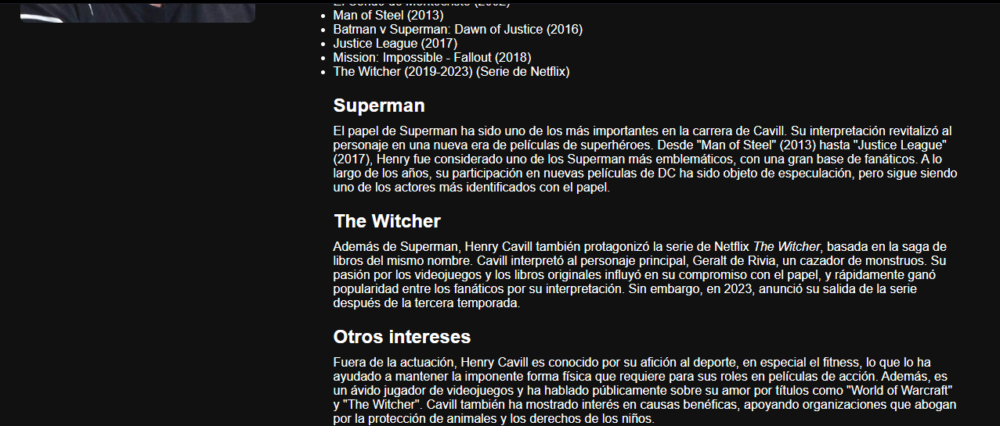
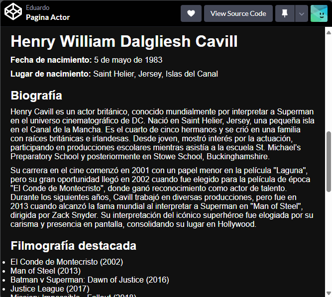

# EvaluacionProgWeb
## Actividad de Evaluacion
#### Introduccion: En esta actividad se elaboraron 2 paginas web diferentes, con su respectivo codigo fuente html y css, uno es una pagina donde muestra la informacion basica de una pelicula y su cast, y la otra pagina muestra informacion general de un actor
## Pagina Web Pelicula
### En esta pagina se usa una estructura basica de visualizacion de informacion de una pelicula, utilizando herramientas como los flexbox, tambien para que la pagina sea responsiva. En la informacion de la pelicula se muestra un resumen basico (tipo sinopsis), tambien se muestra el poster, informacion adicional mostrando el dinero invertido y el dinero ganado y el cast de actores principales y su papel en la pagina

Visita mi Pen en CodePen: [Pagina Pelicula](https://codepen.io/EduardoGV117/pen/Vwombjy)
#### Vista de Pagina de Pelicula

##### Vista responsiva de la pagina

## Pagina Web Actor
### En esta pagina se usa una estructura basica de visualizacion de informacion biografica de un actor, utilizando herramientas como los flexbox, tambien para que la pagina sea responsiva. Entre la informacion del actor viene foto, nombre completo, lugar de nacimiento, filmografias, tambien otros detallitos de su carrera como actor como los premios que ha ganado.

Visita mi Pen en CodePen: [Pagina Actor]([https://codepen.io/EduardoGV117/pen/Vwombjy](https://codepen.io/EduardoGV117/pen/GRVrjaM))

### Vista de Pagina de Actor 

##### Vista Responsiva de la pagina

